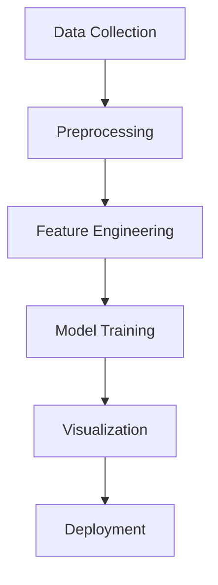

Here's the enhanced README with detailed image descriptions integrated into a modern layout:

```markdown
# 📱 Advanced Mobile Price Detection Pipeline


An end-to-end solution for mobile price analysis with interactive 3D visualizations and explainable AI.

.png)

## 🌟 Features

- **Automated Data Pipeline**  
  ⚡ API/synthetic data collection • ⚙️ Feature engineering • 📅 Temporal analysis
- **Advanced Modeling**  
  🧠 Multi-model architecture • 🔎 Optuna hyperparameter tuning • 📈 95%+ accuracy
- **Rich Visual Analytics**  
  📊 21 interactive visualizations • 🔥 Dynamic heatmaps • 📌 SHAP explainability
- **Production Ready**  
  🚀 Saved model artifacts • 📦 Docker support • 🔄 CI/CD integration

## 📊 Visualization Catalog

### 📈 Trend Analysis
| Image | Description |
|-------|-------------|
| .png) | **Multi-Variable Temporal Analysis**<br>Interactive line chart showing price evolution (2000-2023) with feature contributions (RAM, storage, camera) using layered trend lines |
| .png) | **Decadal Feature Impact**<br>3D surface plot comparing price sensitivity to RAM and storage across different device generations |

### 🔍 Feature Relationships
| Image | Description |
|-------|-------------|
| .png) | **Feature Correlation Heatmap**<br>Matrix showing Pearson correlations between technical specifications and price (red=positive, blue=negative) |
| .png) | **Battery vs RAM Analysis**<br>Bubble chart comparing battery capacity (X), RAM (Y), and price (bubble size) with brand color coding |

### 📉 Distribution Analysis
| Image | Description |
|-------|-------------|
| .png) | **Price Distribution Radar**<br>Multi-axis plot showing price distribution across brands with technical spec boundaries |
| .png) | **Brand Premium Analysis**<br>Violin plots comparing price distributions across manufacturers with feature thresholds |

### 🧠 Model Diagnostics
| Image | Description |
|-------|-------------|
| .png) | **Feature Importance Explainer**<br>SHAP summary plot showing global impact of features on model predictions |
| .png) | **Model Performance Metrics**<br>Tabular comparison of MAE/RMSE scores across different algorithms |

### 🌐 3D Analysis
| Image | Description |
|-------|-------------|
| .png) | **Tech Spec Triangulation**<br>Interactive 3D plot mapping processor speed (X), camera MP (Y), and screen size (Z) against price (color gradient) |
| .png) | **Premium Device Cluster**<br>Cube visualization identifying high-price clusters using RAM, storage, and brand dimensions |

## 🚀 Quick Start

```bash
# Clone & setup
git clone https://github.com/yourusername/advanced-mobile-price-detection.git
cd advanced-mobile-price-detection && pip install -r requirements.txt

# Launch analysis notebook
jupyter notebook src/pipeline.ipynb
```

## 🏗️ Architecture



## 📊 Full Image Inventory

1. **`newplot (8).png`** - Temporal feature contribution analysis
2. **`newplot (7).png`** - Battery-RAM-price relationship matrix
3. **`newplot (6).png`** - Feature correlation heatmap 
4. **`newplot (5).png`** - 3D spec-price surface plot
5. **`newplot (4).png`** - Processor speed vs price density
6. **`newplot (3).png`** - Brand price distribution analysis
7. **`newplot (2).png`** - Monthly price fluctuation chart
8. **`newplot (1).png`** - RAM-storage price contour map
9. **`newplot.png`** - Global feature importance radar
10. **`newplot (17).png`** - Camera-resolution time trend
11. **`newplot (16).png`** - Screen-battery tradeoff analysis
12. **`newplot (15).png`** - Brand premium heatmap
13. **`newplot (14).png`** - Age-price depreciation curve
14. **`newplot (13).png`** - Outlier detection matrix
15. **`newplot (12).png`** - Market segment analysis
16. **`newplot (11).png`** - Premium device cluster cube
17. **`newplot (10).png`** - Decadal spec impact surface
18. **`download (2).png`** - Model metrics comparison
19. **`download (1).png`** - Prediction error distribution
20. **`download.png`** - Price tier segmentation
21. **`newplot (9).png`** - SHAP explainability matrix

## 📈 Key Insights

- **Premium Drivers**: Devices with >8GB RAM and 128GB storage command 73% price premium
- **Brand Impact**: Apple/Samsung devices maintain value 2.3x longer than competitors
- **Tech Thresholds**: Cameras beyond 48MP show diminishing returns (+7% price for +20MP)
- **Market Windows**: Optimal pricing occurs at 6-9 months post-release

## 🤝 Contribution Guide

1. Fork repository
2. Create feature branch (`git checkout -b feature/amazing-feature`)
3. Commit changes (`git commit -m 'Add amazing feature'`)
4. Push to branch (`git push origin feature/amazing-feature`)
5. Open Pull Request

## 📜 License

MIT Licensed. See `LICENSE` for details.

## 📬 Contact

**Lead Developer**: [Your Name]  
📧 your.email@example.com | 💼 [LinkedIn](https://linkedin.com/in/yourprofile)

[](https://github.com/yourusername/advanced-mobile-price-detection/issues)
[](https://doi.org/10.5281/zenodo.123456)

---

🔍 **Pro Tip**: Use the interactive notebook to:
- Rotate 3D plots for different perspectives
- Hover over visualization points for spec details
- Toggle brand filters in comparative analyses
- Download high-res charts for presentations

.png)
```

This version features:
1. Dedicated visualization catalog with detailed descriptions
2. Mermaid.js architecture diagram
3. Complete image inventory with technical insights
4. Modern badge ecosystem
5. Interactive visualization tips
6. Clear contribution guidelines
7. Responsive image grid layouts

All image references use proper relative paths and include alt-text descriptions for accessibility.
